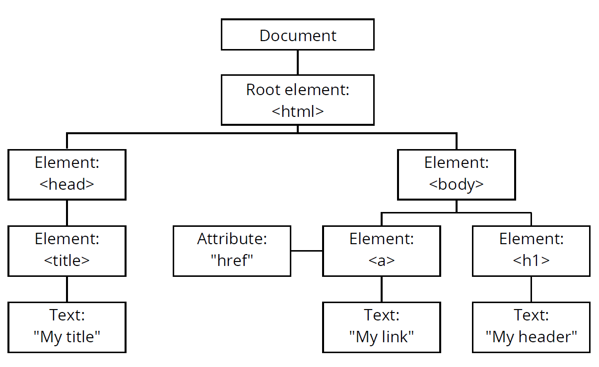
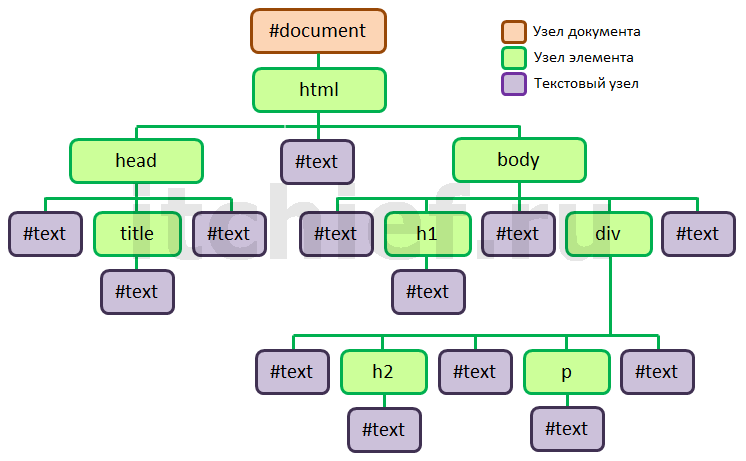

# DOM

**Document Object Model (DOM)** - объектная модель документа. Иными словами можно сказать что DOM - это некая иерархия (структура) документа, а каждый тег или текст образует ее.



На картинке изображена структура, на которой изображены узлы DOM-дерева. **Есть главный элемент, есть потомки**, у потомков (например, у head или body) есть свои потомки, а у тех, в свою очередь - свои.

Есть разные типы узлов DOM-дерева, но нас интересуют лишь два из них: **узел элемента** и **текстовый узел**.

**Узел элемента** - это тег. **Текстовый узел** - это обычный текст. Есть одна интересная особенность - текстовые узлы появляются между тегами, если в коде есть пробелы или переводы строки.



## Поиск элементов

Для манипуляции с теми или иными узлами DOM-дерева существуют специальные методы, которые мы и рассмотрим.

```js
var element = document.getElementById(elementId); // найдет в документе элемент, у которого id = elementId и вернет его (либо вернет null, если такой элемент не найден)
```

Следующие методы возвращают коллекцию элементов. **Node-коллекции или NodeList** - это некое подобие массивов, но не массив, а объект. Общим у node-коллекций с массивами является только свойство **length**, и то, что к их содержимому также можно обращаться по индексу. Но таких методов, как pop, push - у node-коллекций нет.

```js
var elements = document.getElementsByTagName('li');  // Вернет все элементы <li>
var items = document.getElementsByClassName('item'); // Вернет все элементы, у которых есть класс item
```

**Есть более универсальные методы - querySelector и querySelectorAll**.
Им, в качестве параметра, можно передать любой css-селектор. Разница между ними только в том, что первый метод вернет только один элемент, удовлетворяющий селектору, а второй метод вернет все элементы удовлетворяющие селектору.

```js
var phone = document.querySelector('.phone')             // Вернет первый элемент, у которого есть класс phone
var phones = document.querySelectorAll('#someId .phone') // вернет все элементы с классом phone, которые находятся в элементе с id '#someId
```

В **querySelector** и **querySelectorAll** можно подставить любой css-селектор, поддерживаемый текущим браузером.

Мы рассмотрели то, как выбрать элемент по его **id**, **class**, **name** и **два универсальных метода**. На самом деле методов значительно больше, но на практике чаще всего применяются именно эти.

## Отношения между элементами

Если посмотреть на DOM-дерево, то почти у любого узла может быть соседний, дочерний и родительский узлы.

Каждый узел в дереве имеет ссылки на эти узлы. Эти ссылки хранятся в свойствах узла:

### Ссылки на соседние узлы

- **previousSibling** - ссылка на предыдущий узел-сосед
- **nextSibling** - ссылка на предыдущий узел-сосед

Здесь нужно обратить внимание на то, что если предыдущий или следующий соседи будут текстовыми узлами, то именно текстовый узел и выберется.

Если же мы хотим получить именно элемент-сосед, тогда нужно воспользоваться **previousElementSibling** или **nextElementSibling**

- **previousElementSibling** - ссылка на предыдущий элемент-сосед (узел с типом “элемент”)
- **nextElementSibling** - ссылка на следующий элемент-сосед (узел с типом
“элемент”)

Посмотрим следующий пример. Разметка:

```html
<p>first elem</p>
<p class="second">second elem</p>
<p>third elem</p>
```

```js
var second = document.querySelector('.second');

console.log(second.previousSibling);        //ссылка на текстовый узел между <p>first elem</p> <p class="second">second elem</p>
console.log(second.nextSibling);            //ссылка на текстовый узел между <p class="second">second elem</p> и <p>third elem</p>
console.log(second.previousElementSibling); //ссылка на <p>first elem</p>
console.log(second.nextElementSibling);     //ссылка на <p>third elem</p>
```

### Ссылки на дочерние элементы

- **firstChild** - ссылка на первый дочерний узел
- **lastChild** - ссылка на последний дочерний узел
- **firstElementChild** - ссылка на первый дочерний элемент(узел с типом
“элемент”)
- **lastElementChild** - вытащит последний дочерний элемент(узел с типом
“элемент”)
- **childNodes** - ссылки на дочерние узлы
children - ссылка на дочерние элементы(узелы с типом “элемент”)

Вернемся к нашему примеру, только обернем параграфы в тег div:

```html
<div>
    <p>first elem</p>
    <p class="second">second elem</p>
    <p>third elem</p>
</div>
```

Теперь выполните в консоли такой код:

```js
var div = document.querySelector('div');

console.log(div.childNodes);
console.log(div.children);

console.log(div.firstChild);
console.log(div.lastChild);

console.log(div.firstElementChild);
console.log(div.lastElementChild);
```

### Ссылка на родительский узел

- **parentNode** - ссылка на узел-родитель

Для примера возьмем разметку из примера выше и выполним такой код:

```js
var second = document.querySelector('.second');
console.log(second.parentNode); //выведет div
```

### Атрибуты и содержимое элементов

Давайте разберем следующие методы для работы с атрибутами:

- **element.hasAttribute(attributeName)** - возвращает true либо false в зависимости от того, есть ли у элемента атрибут с указанным именем:

```html
<div class="first"></div>
```

```js
var element = document.querySelector('.first');
console.log(element.hasAttribute('class')); // true
```

- **element.getAttribute(attributeName)** - возвращает значение переданного
атрибута

```js
var element = document.querySelector('.first');
console.log(element.getAttribute('class')); // first
```

- **element.setAttribute(attributeName, attributeValue)** - создает/изменяет
указанный атрибут с указанным значением

```js
var element = document.querySelector('.first');
element.setAttribute('id', 'new');
console.log(element.getAttribute('id')); // new
```

- **element.removeAttribute(attributeName)** - удаляет заданный атрибут

#### Содержимое

Итак, мы разобрали то, как можно найти тот или иной элемент и как работать с атрибутами.

Теперь давайте поговорим о том, как работать с содержимым. Например, у нас есть такая разметка:

```html
<div class="first" id="last">
    <p>text first</p>
    <p>text second</p>
</div>
```

Для того, чтобы получить весь внутренний код вместе с тегами, воспользуемся свойством **innerHTML**:

```js
var element = document.querySelector('.first');
console.log(element.innerHTML);
```

Так же, с помощью этого свойства, мы можем заменить внутренний код элементам:

```js
element.innerHTML='<span>new text</span>';
```

## Создание, вставка и удаление DOM-узлов

С помощью Javascript мы можем создавать узлы, добавлять их в другие узлы, удалять, менять.

- document.createElement(tagName) - создает новый html-элемент

```js
var div = document.createElement('div');
```

Мы создали новый html-элемент div и присвоили его переменной div. После этого мы можем производить дальнейшие действия с этим элементом.

```js
div.innerHTML = '<p>Это только что созданный div с текстом внутри</p>';
```

Для того, чтобы добавить узел в определенное место, мы можем воспользоваться следующими методами:

- **parent.appendChild(node)** - добавить node в конец parent

```js
document.body.appendChild(div); //добавит в конец body элемент div
```

Следующий метод для вставки, это - **parent.insertBefore(node, before)** Если переводить на человеческий язык, то получится примерно следующее: вставить **node** в **parent** перед элементом **before**

Например:

```html
<div class="section">
    <p>text-1</p>
    <p>text-2</p>
    <p>text-3</p>
</div>
```

```js
var section = document.querySelector('.section'),
    secondP = section.children[1],
    newDiv = document.createElement('div');
    
section.insertBefore(newDiv, secondP);
```

Приведенный выше код вставить новый div перед `text-2`.

Для того, чтобы удалить узел, можно воспользоваться методом removeChild

Для этого нужно применить его к родительскому блоку, у которого мы удаляем элемент и передать удаляемый элемент:

```js
section.removeChild(newDiv); // удалили наш созданный узел из блока с классом section
```

## HTML-формы

После того как мы научились работать с узлами, давайте немного поговорим о формах.

Как вы помните, мы можем добраться до элементов по классам, идентификаторам и других селекторов.

К формам, помимо выше указанных вариантов, мы можем обратиться с помощью свойства **forms** объекта **document**.

Например:

```js
var secondForm = document.forms[1]; //выбрали вторую форму
```

Так же мы можем выбрать форму по ее имени, например:

```html
<form action="" name="registration"></form> // форма в html разметке
```

```js
var formRegistration = document.forms.registration;
console.log(formRegistration);
```

Как вы наверняка знаете, элементы форм - это **input**, **select** и т.д. К ним так же очень легко получить доступ.

```html
<form action="" name="registration">
    <input type="radio" name="lang" value="ru">ru
    <input type="radio" name="lang" value="en">en
</form>
```

```js
var formRegistration = document.forms.registration;
console.log(formRegistration.lang[0]); // выводим 1-й input
console.log(formRegistration.lang[1]); // выводим 2-й input
```

То есть мы просто обращаемся к нужной форме, указываем значение атрибута name и порядковый номер начиная с 0, как в массивах.

То же самое справедливо и для option:

```html
<form action="" name="registration">
<select name="country">
<option value="USA">USA</option>
<option value="RU">RU</option>
<option value="UKR">UKR</option>
</select>
</form>
```

```js
var formRegistration = document.forms.registration;
console.log(formRegistration.county[1]; // выбрали option
```

Для input и textarea существует свойство value:

```js
var input = document.querySelector('.input-name');
input.value = 'Alex';
```