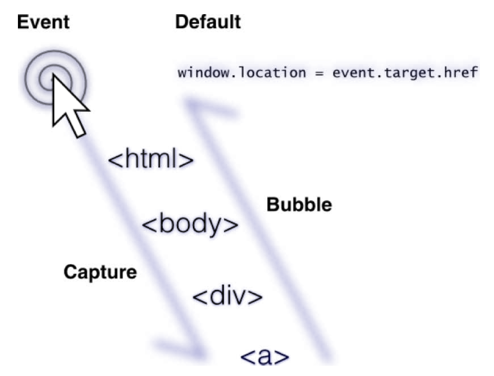

# События

**Механизм DOM-события** призван помочь разработчику перехватить и обработать различные действия пользователей (клики мышкой по элементам, нажатия клавиш и прочее). 

Почти все(не все) события состоят из двух фаз:
- **capturing(захват)**
- **bubbling(всплытие)**

Когда происходит событие, информация о нем спускается от корневого элементам dom-дерева вниз, до того элементам, на котором произошло событие (например, если кликнули по ссылке, то событие спускается от корня дерева до ссылки). **Этот процесс называется фазой захвата**.

После этого, процесс начинается в обратном порядке. То есть информация о событии поднимается от элемента, на котором произошло событие до корневого элемента dom-дерева. **Этот процесс называется фазой всплытия**.

После того, как событие “всплывет” происходит действие по умолчанию. Например для ссылок, действием по умолчанию является переход на сайт, заданный в атрибуте href. 

Ниже приведен рисунок, который поможет визуально понять суть



Разработчик может установить свой обработчик события на любую из фаз.

## Регистрация обработчиков событий

Для того, чтобы добавить обработчик события на элемент, есть несколько способов.

Для того, чтобы заставить браузер перехватывать события, происходящие с элементами(например клики), необходимо использовать следующие методы:

EventTarget.addEventListener(event, handler, inCapture) добавить новый обработчик события к EventTarget. Будет выполняться handler при каждом событии event происходящем с EventTarget. Если в inCapture передать true, то обработчик будет выполнять не на фазе всплытия, а на фазе захвата. EventTarget.removeEventListener(event, handler) удалить у элемента обработчик handler события event. В качестве EventTarget может выступать любой элемент документа. 


Первый - добавить атрибут on* (вместо звездочки подставить имя события)

```html
<button onclick="alert('click')">click me</button>
```

Здесь мы добавили обработчик кликов мышкой по элементу. Таким образом, при клике мышкой по элементу, сработает код который указан в значении атрибута onclick(в нашем случае это alert(‘click’)).

Мы не рекомендуем добавлять таким образом обработчики события, т.к. это считается плохим стилем и влечет за собой путаницу между логикой и ее представлением.

Второй способ - **присвоить в свойство on*** элемента функцию, которая отработает при наступлении событии. Например: 
```html
<button>click me</button>
<script>
var button = document.querySelector('button');
    // находим элемент
    button.onclick = function() {
    alert('click');
}
</script>
```
Этот вариант лучше первого, но существует недостаток - мы не можем добавить несколько обработчиков событий. И хотя данную проблему можно обойти. существует и третий, предпочтительный метод.

Третий вариант, который мы рассмотрим - **установка обработчиков через метод addEventListener **

Это наиболее предпочтительный вариант. Мы рекомендуем использовать именно его. При помощи данного метода, вы можете задавать несколько обработчиков события.

```html
var button = document.querySelector('button');

button.addEventListener('click', function() {
    alert('click');
})

button.addEventListener('click', function() {
    alert('second');
})
```

При клике на кнопку сработают оба обработчика. В том порядке, в котором они были установлены.

Первым параметром необходимо передать **имя** события, на которое нужно установить обработчик.

Вторым параметром - **функцию**, которая будет выполнять роль обработчика.

Есть так же третий параметр. Дело в том, что любой обработчик по умолчанию выполняется на фазе всплытия.

Если в **addEventListener**, третьим параметром, передать true, то обработчик будет выполняться на фазе захвата.

Для того, чтобы удалить обработчик события с элемента, необходимо воспользоваться методом **removeEventListener**:

```js
function handler1() {
    console.log('обработчик 1');
}
function handler2() {
    console.log('обработчик 2');
}
var button = document.querySelector('button');

button.addEventListener('click', handler1);
button.addEventListener('click', handler2);
button.removeEventListener('click', handler2);
```

```js
let cb1 = () => console.log('Обработчик 1');
let cb2 = () => console.log('Обработчик 2');

var button = document.querySelector('button');

button.addEventListener('click', cb1 );
button.addEventListener('click', cb2, true );
button.removeEventListener('click', cb1 );
```
При клике на кнопку, сработает только первый обработчик, т.к. второй обработчик мы удалили сразу после того, как добавили. 

Обратите внимание, что при удалении обработчика, необходимо указать переменную с функцией-обработчиком. Иначе браузер не сможет удалить обработчик из элемента. Для этого, просто храните обработчики в именованных функциях или в переменных.

## Объект события

Когда браузер вызывает обработчик события, он передает в эту функцию первым параметром специальный объект с описанием события. Вот основные свойства этого объекта:

- **type** - имя события
- **target** - элемент, для которого изначально было предназначено событие currentTarget - элемент, который перехватил событие в данный момент eventPhase - фаза события (захват, выполнение, всплытие)
- **currentTarget** элемент, который перехватил событие в данный момент
- **eventPhase** фаза события (захват, выполнение, всплытие)


```js
button.addEventListener('click', function(e){
    console.log(e);
});
```

У данного объекта так же есть метод preventDefault, который мы сейчас рассмотрим.

## Действие по умолчанию

**У html-элементов есть действие по умолчанию.**

Например:

При клике на элементы `<a>` - происходит переход по ссылке из атрибута `href`.

При нажатии клавиш в текстовое поле - вывод введенных символов.

Механизм событий позволяет отменить действие по умолчанию при помощи вызова метода `preventDefault` из объекта с информацией о событии.

Например, вот как можно запретить переход по ссылке:

```html
<a href="http://ya.ru" id="link">link</a>
<script>
link.addEventListener('click', function(e){
    e.preventDefault();
});
</script>
```
Теперь, при клике по ссылке, перехода осуществлено не будет.

## События мыши

Наверное одно из самых распространенных событий это клик “мышкой” по элементу.

```html
<button>Click me</button>
<script>
    var button = document.querySelector('button');

    button.addEventListener('click', function() {
    // вешаем обработчик события на клик
        alert('click'); // выводим сообщение по клику
    });
</script>
```
Менее распространенный - `dblclick`, срабатывает при двойном клике.

- `mousedown` - это событие отрабатывает на нажатие левой клавиши. Разница между ним и click в том, что событие click - это нажатие и отпускании левой кнопки мышки, а mousedown - только нажатие.
- `mouseup` - это событие отрабатывает при отпускании кнопки мышки.
- По факту, **событие click вмещает в себя два события - mousedown и mouseup**. Выполняются они в таком порядке: `mousedown`, `mouseup`, `click`.
- `mouseover` - срабатывает по наведению курсора на элемент;
- `mouseout` - срабатывает по отводу курсора с элемента;
- `mousemove` - срабатывает при каждом движении курсора над элементом.

## Cобытия клавиатуры

- `keydown` - Отрабатывает по нажатию на клавишу
- `keyup` - Отрабатывает по отжатию клавиши

```html
<input type="text" />
<script>
    var input = document.querySelector('input');
    input.addEventListener('keydown', function() { // по нажатию на
        alert('key'); // клавишу в текстовом поле отработает alert
    })
</script>
```
- `keypress` - Отрабатывает по нажатию на клавишу. В отличии от keydown, событие keypress срабатывает только на те клавиши которые печатают символы. То есть такие клавиши как **ctrl**, **alt**, **shift** не входят в эту категорию, так как на печатают символы.

```html
<input type="text" />
<script>
    var input = document.querySelector('input');
    input.addEventListener('keypress', function() {
        alert('key');
    });
</script>
```
По нажатию на **shift**, **fn**, **ctrl**, **alt**, **backspace** код выше не сработает.

В объект событий **keydown**, **keypress**, и **keyup**, передается свойство **key-Code**, которое содержит в себе код введенного символа по ASCII-таблице (пример таблицы по ссылке).

Событие keypress возникает сразу после keydown, если нажата символьная клавиша, т.е. нажатие приводит к появлению символа. Любые буквы, цифры генерируют keypress. Управляющие клавиши, такие как Ctrl, Shift, F1, F2… – keypress не генерируют.

События keydown/keyup происходят при нажатии/отпускании клавиши и позволяют получить её скан-код в свойстве keyCode. Скан-код клавиши одинаков в любой раскладке и в любом регистре. Например, клавиша z может означать символ "z", "Z" или "я", "Я" в русской раскладке, но её скан-код будет всегда одинаков: 90.

Событие input срабатывает тут же при изменении значения текстового элемента и поддерживается всеми браузерами, кроме IE8-.


Мы можем получить непосредственно введенный символ из его кода, при помощи Метода String.fromCharCode(code).

Либо можем обрабатывать “сырые” коды клавиш. Например, из таблицы видно, что код с 48 по 57 - это числа от 0 до 9. Зная это, мы можем очень просто сделать обработчик ввода, который не будет давать вводить в текстовое поле ничего кроме цифр:

```js
inp.addEventListener('keydown', function(e) {
    if (e.keyCode < 48 || e.keyCode > 57) {
        e.preventDefault();
    }
});
```

- `input` - событие, которое выполняется для текстовых полей, при каждом изменении значения в поле. В отличии от остальных событий клавиатуры, в объект события не передается дополнительных свойств типа charCode. **input** просто сообщает о том, что содержимое текстового поля было изменено.

Указанные события выполняются в такой последовательности: `keydown`, `keypress`, `input`, `keyup`.

## События загрузки документа

Загрузка документа делится на два этапа:
- загрузка html и скриптов
- загрузка внешних ресурсов

Каждый из этих этапов можно перехватить и обработать.

**DOMContentLoaded** - событие, которое сработает после того, как весь html будет загружен браузером и js в документе будет выполнен. То есть все dom-элементы будет созданы и доступны через JS.

Данное событие срабатывает на объекте **document**:

```js
document.addEventListener("DOMContentLoaded", function() {
    console.log("html структура загружена");
});
```

- `load` - событие, которое сработает, когда браузер загрузит все внешние ресурсы (картинки, css) и страница будет полностью готова к работе.

Данное событие срабатывает на объекте **window**:

```js
window.addEventListener('load', function() {
    console.log("страница полностью готова");
});
```

## Делегирование

**Делегирование** - это когда элементы возлагают обязанности по обработке своих событий на вышележащие элементы.

Предположим, что у нас есть **div**, внутри которого располагаются 1000 кнопок.

Вешать обработчик события на каждую кнопку - не разумно. Проще повесить один обработчик на div. Ведь при клике на кнопку, события об этом сначала погрузится от корня документ до кнопки, по которой произошел клик, пройдя через div, а затем всплывет от кнопки, по которой произошел клик до корня документа, тоже пройдя через div.

**Мы можем повесить обработчик события click для div на любую фазу**, и клики по любой кнопке будут так и иначе перехвачены всего лишь одним общим обработчиком. Это и есть делегирование.

```js
<ul id="list">
    <li my-attr="1"></li>
    <li my-attr="2"></li>
    <li my-attr="3"></li>
    <li my-attr="4"></li>
    <li my-attr="5"></li>
    <li my-attr="6"></li>
    <li my-attr="7"></li>
    <li my-attr="8"></li>
</ul>

<script>
    list.addEventListener("click", e => console.log("click on " + e.target.getAttribote("my-attr")))
</script>
```

## Предотвращение распространения события

Как вы помните, большая часть событий сначала погружается вниз по дереву, а затем - всплывает. А по умолчанию, обработчики событий выполняются на фазе всплытия.

Внутри обработчика события мы можем “приказать” событию не следовать дальше по дереву, после выполнения данного обработчика. 

Это можно сделать при помощи метода **stopPropagation** объекта события.

Есть такой код:

```html
<div id="div1">
    <div id="div2">
        <div id="div3">
            <button id="button">click me</button>
        </div>
    </div>
</div>

<script>
var els = document.querySelectorAll('body *');
for (var i = 0; i < els.length; i++) {
    els[i].addEventListener('click', function(e) {
        console.log(e.currentTarget.id);
        //эквивалентно console.log(this.id);
    });
}
</script>
```

Здесь мы выбираем все элементы внутри **body** (3 дива и кнопка) и на каждый из них вешаем обработчик события **click**. Обработчики этих элементов сработаеют при клике на кнопку, при всплытии события, то есть когда событие будет идти уже от кнопки к корню дерева. Задача данного обработчика проста - вывести id элемента, который в данный момент обрабатывает событие. Для этого, мы обращаемся с свойству **currentTarget** объекта события. Мы не можем обратиться к свойству **target**, потому что, как вы помните, свойство **target** всегда ссылается на тот элемент, на котором произошло событие, а не на тот элемент, на котором сейчас сработал обработчик. 

Соответственно, после клика на кнопку, выведет в консоль сообщения в таком порядке:
- button
- div3
- div2
- div1

**Именно в таком**, потому что обработчики выполнятся на фазе всплытия события от элемента.

Теперь давайте добавим к элементу с id="div3" такой обработчик, который будет препятствовать дальнейшему всплытию события, после того, как этот обработчик сработает.

После цикла for добавим такой код:
```js
div3.addEventListener('click', function(e) {
    e.stopPropagation();
});
```

Добавляем еще один обработчик к элементу div3. Соответственно, когда событие, всплывая, дойдет до элемента

Соответственно, когда событие, всплывая, дойдет до элемента div3, то сначала сработает первый обработчик на этом элементе, который выведет **id** данного элемента, а затем сработает тот обработчик, который мы только что написали, который, в свою очередь, прервет дальнейшее всплытия события засчет **stopPropagation**. Соответвенно, обработчики на элементах **div2** и **div1** выполнены не будут, т.к. событие просто не всплывет к ним. 

Убедитесь сами, в консоль будет выведено:
- button
- div3

## jQuery события

Библиотека jQuery помогает нам решить много проблем, связанных с кроссбраузерностью, в ней есть как стандартные методы Javascript, так и свои собственные.

- `on` - с помощью этого метода мы будем устанавливать обработчики событий.

```html
<button>click</button>

<script>
var button = $('button');
button.on('click', function() { // по нажатию на кнопку отработает alert
    alert('click');
    return false // prevent default - return false удалить обработчик
});
</script>
```

Вешаем обработчик события с помощью `on()`, передавая первым аргументом тот или иной обработчик события.

- `click()` - Устанавливает обработчик клика левой клавишей мыши по элементу.
- `dblclick()` - Устанавливает обработчик двойного "клика" мышью по элементу, либо запускает это событие.
- `hover()` - Устанавливает обработчик двух событий - появления/исчезновения курсора над элементом.

Например:
```html
<button>click</button>
<script>
var button = $('button');
button.hover(
    function() { // по наведению
        alert(first); // кнопку отработает 1-й alert
    },
    function() { // при отведении курсора сработает второй alert
        alert('second');
    }
);
</script>
```

- `mousedown()` - Устанавливает обработчик нажатия кнопки мыши.
- `mouseup()` - Устанавливает обработчик поднятия кнопки мыши.
- `mouseenter()` - Устанавливает обработчик появления курсора в области элемента. Появление этого события отработано лучше, чем стандартного mouseover.
- `mouseleave()` - Устанавливает обработчик выхода курсора из области элемента. Появление этого события отработано лучше, чем стандартного mouseout.
- `mousemove()` - Устанавливает обработчик движения курсора в области элемента.
- `mouseout()` - Устанавливает обработчик выхода курсора из области элемента, либо запускает это событие.
- `toggle()` - Поочередно выполняет одну из двух или более заданных функций, в ответ на "клик" по элементу.


