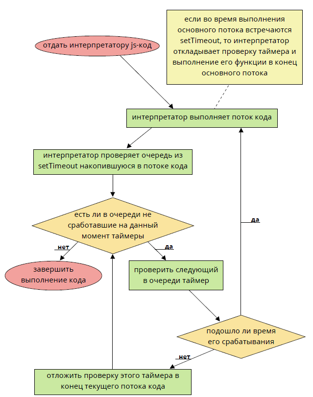

# Асинхронность

## Жизненный цикл JavaScript

**Жизненный цикл JavaScript работает как очередь событий.**

Когда js-интерпретатору поступает код, который нужно выполнить, интерпретатор начинает выполнять его строка за строкой. Этот этап выполнения называет **основным потоком**.

Код на данном этапе выполняется синхронно, то есть каждая новая команда ждет, пока выполнится предыдущая.

Код **ВСЕГДА** выполняется таким образом. Так же, нет способа приостановить выполнение кода.

В то же время, JS позволяет отложить выполнение кода и таким образом эмулировать асинхронность.

**Асинхронность** - возможность выполнять два или более участка кода параллельно с основным потоком, то есть не блокируя при этом основной поток.

Как было сказано выше - JS позволяет лишь эмулировать асинхронность кода.

Браузерный JS предоставляет только один способ эмулировать асинхронность - использовать функцию **setTimeout**.

## Таймеры

**Установка таймера.**

**setTimeout** имеет два параметра: функцию, выполнение которой должно быть отложено и количество миллисекунд, на которые нужно отложить выполнение функции.

Функция, указанная первым аргументом, выполнится через количество миллисекунд, указанное вторым аргументом.

Может показаться, функция будет выполнена параллельно с основным потоком кода. Но это не так. `setTimeout` лишь запускает таймер. Но проверку на то - пора ли выполнить функцию, указанную первым аргументом, таймер сможет сделать только после того, как будет выполнен основной поток кода. Даже если вторым параметром указать несколько миллисекунд и основной поток при этом будет выполняться дольше этих нескольких миллисекунд, то таймер все равно не сработает, пока не будет выполнен основной поток кода. Таким образом можно сделать вывод, что `setTimeout` добавляет функцию, указанную первым параметром в конец основного потока. Если было вызвано несколько `setTimeout`, то функции всех таймеров будут добавлены в конец основного потока, тем самым образуя очередь. После того, как основной поток будет выполнен, интерпретатор начнет перебирать установленные таймеры, один за другим и будет проверять - не подошло ли время какому-либо из них сработать.

Если какому-либо из установленных таймером уже пора сработать, интерпретатор выполняет код внутри функции таймера. При чем выполняет таким образом, что код внутри этой функции тоже становится своеобразным основным потоком и интерпретатор вновь начнет выполнять его по вышеизложенному алгоритму.

Кстати, функция, передаваемая в **setTimeout**, называется `callback-функцией`.

`callback-функция` - это функция, которая будет вызвана в будущем, когда произойдет какое-то событие. В случае с **setTimeout** - когда подойдет время таймера.

Вот блок-схема, которая отражает указанный



#### Отмена таймера

`Функция setTimeout` возвращает числовой идентификатор таймера **timerId**, который можно передать в функцию **clearTimeout** для отмены действия.

```js
var timerId = setTimeout(function() {
    //....
}, 1000);
clearTimeout(timerId);
```

#### Интервалы

`setInterval` запускает выполнение функции не один раз, а регулярно повторяет её через указанный интервал времени:

Cледующий пример при запуске станет выводить сообщение каждые две секунды:

```js
// начать повторы с интервалом 2 сек
var timerId = setInterval(function() {
    alert("шаг");
}, 2000);
```

Остановить исполнение можно вызовом **clearInterval(timerId)**.

#### Рекурсивный setTimeout

`Альтернатива setInterval – это рекурсивный setTimeout.`

`Рекурсивный setTimeout` – более гибкий метод тайминга, чем **setInterval**, так как время до следующего выполнения можно запланировать по-разному, в зависимости от результатов текущего:
```js
var timerId = setTimeout(function step() {
    alert("step");
    timerId = setTimeout(tick, 4000);
}, 2000);
```

## Callback

`Все функции в JavaScript являются объектами`, и именно поэтому мы можем подобно объектам создавать их, передавать в качестве параметров другим функциям, возвращать в качестве результата функции.

```js
var fruits = ['Apple', 'Pear', 'Orange', 'Banana'];

fruits.forEach(function(value, index) {
    console.log(index, value);
});
```
В данном примере мы также передали анонимную функцию в качестве параметра в метод **forEach**.

Когда мы передаем одну функцию другой в качестве параметра — мы фактически передаем ее определение. На этом этапе передаваемая функция не вызывается и не выполняется.

Когда мы передаем одну функцию другой в качестве параметра — мы фактически передаем ее определение. На этом этапе передаваемая функция не вызывается и не выполняется.

Важно понимать, что функция обратного вызова не выполняется немедленно. Точка внутри содержащей функции, в которой вызывается функция обратного вызова как раз и называется “обратным вызовом”. Кроме того, по сути функция обратного вызова является замыканием. Замыкания имеют доступ к области видимости содержащей функции, а значит могут использовать любые переменные, определенные внутри содержащей функции.

## Event

Выполнение действий по какому-либо событию:
```js
//выполнение анонимной функции при отправке html-формы
someForm.addEventListener('submit', function(event) {
    //....
});
```

Данный вариант очень похож на **callback** за тем исключением, что можно отписаться от события **(removeEventListener)**, так же, на событие можно подписаться несколько раз.


## Promise

**Объект Promise (обещание) используется для отложенных и асинхронных вычислений.**
```js
new Promise(executor);
new Promise(function(resolve, reject) { ... });
```

**Интерфейс Promise** (обещание) представляет собой обертку для значения, неизвестного на момент создания обещания. Он позволяет обрабатывать результаты асинхронных операций так, как если бы они были синхронными: вместо конечного результата асинхронного метода возвращается обещание получить результат в некоторый момент в будущем. Главное отличие от событий в том, что Promise меняют состояние только 1 раз (в событиях, состояние меняется сколько угодно раз), запоминают своё состояние (в  kl отличии от события).

При создании, обещание находится в ожидании **(pending)**, а затем может перейти в состояние выполнено **(fulfilled)**, вернув полученный результат **(значение)**, или отклонено **(rejected)**, вернув причину отказа. В любом из этих случаев, вызывается обработчик, прикрепленный к обещанию методом **then**.

```js
var Promise = new Promise(function(resolve, reject) {
    //здесь можно прозводить асинхронные операции
    //но асинхронная операция ОБЯЗАТЕЛЬНО должна вызвать функцию resolve или reject
});
Promise.then(function(result) {
    console.log(result); //выводим результат
}, function(err) {
    console.log(err); //ошибка
});
```

Метод `"then"` не является окончательным, можно выстраивать цепочки вызовов методов **then** и в процессе данных вызовов, менять значение **"value"**:

```js
var Promise = new Promise(function(resolve, reject) {
    resolve(1);
});
Promise.then(function(val) {
    console.log(val); // 1
    return val + 2;
}).then(function(val) {
    console.log(val); // 3
});
```

## Deferred

`Deferred объект (в jQuery)` — это всего лишь хранилище состояния асинхронной функции. Таких состояний обычно несколько:

| Состояние |  Описание                    |
|-----------|------------------------------|
| pending   |ожидание завершения процесса  |
| rejected  | процесс закончен падением    |
| resolved  | процесс закончен успешно     |

Кроме того у **Deferred** объекта есть ряд методов, которые могут менять его состояние.

По состоянию **Deferred** объекта мы можем судить, закончен ли процесс, состояние которого мы отслеживаем.

#### Список методов

- `.done()` `.fail()` `.then()` `.always()` регистрируют обработчики перехода объекта deferred в состояние "выполнено"/"ошибка выполнения" (resolved/rejected), .then() регистрирует два обработчика сразу, а .always() общий обработчик на оба события).
- `.progress()` регистрирует обработчики прогресса выполнения объекта deferred.
- `.resolved()` `.reject()` переводят объект deferred из состояния "не выполнено" в "успешно выполнено"/"ошибка выполнения".
- `.notify()` вызывает событие частичного выполнения deferred (его прогресса выполнения).

```js
var deferred = $.Deferred(function(obj) {
    obj.done(someCallback);
});
```

При создании, объект **jQuery.Deferred** находится в состоянии **unresolved** (еще не выполнено). После этого, состояние объекта можно изменить на resolved (выполнено) с помощью метода `.resolve()` или `.resolveWith()`, а так же в состояние **rejected** (ошибка при выполнении), если вызвать метод `.reject()` или `.rejectWith()`. Важно отметить, что объект **jQuery.Deferred** может изменить свое состояние только один раз!

С помощью метода `.done()` можно установить обработчик удачного выполнения объекта **Deferred**, `.fail()` установит обработчик неудачного выполнения. В методе `.then()` можно задать оба вида обработчиков, а `.always()` установит обработчик, который будет вызван при переходе в любое из состояний. Если установить обработчик на объект **Deferred**, который уже находится в выполненном состоянии, то он (обработчик) будет запущен незамедлительно:

```js
// Реализуем функцию test, которая запустит someAction() в течении 10 секунд.
// Возвращаемый объект Deferred будет оповещать о выполнении someAction()

function test() {
    var d = $.Deferred(),
        actTime = 10000 * Math.random(); // время запуска 0-10 сек
        
    setTimeout(function() {
        someAction(); // выполняем интересующую функцию
        d.resolve(); // изменяем состояние Deferred объекта на "выполнено"
    }, actTime);
    
    return d;
}
var defrr = test();

// устанавливаем обработчик выполнения Deferred-объекта
defrr.done(function() {
    alert("someAction выполнен");
});
```

## AJAX

**Ajax означает Асинхронный JavaScript и XML**. В основе технологии лежит использование объекта `XMLHttpRequest`, необходимого для взаимодействия с http-сервером. Объект может как отправлять, так и получать информацию в различных форматах включая **XML(HTML)**, **JSON** и **обычный текст**.

Самое привлекательное в `Ajax` — это его асинхронный принцип работы. С помощью этой технологии можно осуществлять взаимодействие с сервером без необходимости перезагрузки страницы. Это позволяет обновлять содержимое страницы частично, в зависимости от действий пользователя.

Использовать `XMLHttpRequest` очень просто. Вы создаете экземпляр объекта, настраиваете соединение с сервером, добавляете обработчики событий и отправляете запрос. Статус HTTP-ответа, так же как и возвращаемый от сервера результат, доступны в свойствах объекта запроса:

```js
var req = new XMLHttpRequest();

req.open('GET', 'http://www.mozilla.org/', true);
//третий аргумент true означает асинхронность
req.onload = function() {
    console.log(req.response);
};
req.send();
```

#### Наблюдение за прогрессом

`XMLHttpRequest` предоставляет возможность отлавливать некоторые события которые могут возникнуть во время обработки запроса. Включая периодические уведомления о прогрессе, сообщения об ошибках и так далее.

Если к примеру вы желаете предоставить информацию пользователю о прогрессе получения документа, вы можете использовать код вроде этого:

```js
function onProgress(e) {
    var percentComplete = (e.position / e.totalSize) * 100;
    console.log('Выполнено %s%', percentComplete);
}
function onError() {
    console.error(e);
}
function onLoad() {
    console.log('Завершено!');
}
var req = new XMLHttpRequest();
req.open("GET", 'http://......', true);
req.onprogress = onProgress;
req.onload = onLoad;
req.onerror = onError;
req.send();
```

Атрибуты события **onprogress: position и totalSize**, отображают соответственно текущие количество принятых байтов и количество ожидаемых байтов.

#### Виды данных

От сервера можно получить данные нескольких видов:
- **Обычный текст**
- **XML(HTML)**
- **JSON**

Текстовые и XML ответы можно сразу вставлять на страницу, а вот JSON-ответы необходимо дополнительно обрабатывать.

#### JSON

**JSON (JavaScript Object Notation)** — это такой формат, в котором могут передаваться данные. При этом, данные представляют собой обычный JS-объект.

При получении JSON-данных, вы получаете самый обычный JS-объект, значения свойств которого, должны обработать по своему усмотрению.

Пример JSON:

```json
{
    "data": {
    "misc": [
        {
            "name": "JSON-элемент один",
            "type": "Подзаголовок 1"
        },
        {
            "name": "JSON-элемент два",
            "type": "Подзаголовок 2"
        }
    ]
    }
}
```

#### Свойства и методы XMLHTTPRequest

- `responseType` - в каком формате мы ожидаем ответ от сервера. Должно быть установлено до отправки запроса. 
- `responseText` - ответ от сервера в виже обычного текста. Свойство будет доступно ПОСЛЕ того, как придет ответ от сервера
- `responseXML` - Если вы загрузили **XML** документ, то свойство responseXML будет содержать документ в виде **XmlDocument** объекта которым вы можете манипулировать используя **DOM** методы. Если сервер отправляет правильно сформированные **XML** документы но не устанавливает **Content-Type** заголовок для него, вы можете использовать **overrideMime-Type()** для того чтобы документ был обработан как **XML**. Если сервер не отправляет правильно сформированного документа **XML**, **responseXML** вернет **null** независимо от любых перезаписей **Content-Type** заголовка. Свойство будет доступно **ПОСЛЕ** того, как придет ответ от сервера.
- `response` - ответ от сервера в том формате, в котором он был указан в свойстве **responseType** до отправки запроса. Свойство будет доступно **ПОСЛЕ** того, как придет ответ от сервера
- `overrideMimeType()` Этот метод может быть использован для обработки документа особенным образом. Обычно вы будете использовать его, когда запросите **responseXML**, и сервер отправит вам **XML**, но не отправит правильного **Content-Type** заголовка.
- `setRequestHeader()` Этот метод может быть использован чтобы установить **HTTP** заголовок в запросе до его отправки.
- `getResponseHeader()` Этот метод может быть использован для получения **HTTP** заголовка из ответа сервера
- `abort()` Этот метод может быть использован чтобы отменить обрабатываемый запрос.

## jQuery.ajax

`jQuery.ajax` это основной метод, а все последующие методы лишь обертки для метода **jQuery.ajax**. У данного метода лишь один входной параметр – объект включающий в себя все настройки


|               |                                                                                                     |
|---------------|-----------------------------------------------------------------------------------------------------|
| async         | асинхронность запроса, по умолчанию true                                                            |
| cache         | вкл/выкл кэширование данных браузером, по умолчанию true                                            |
| contentType   | по умолчанию “application/x-www-form-urlencoded”                                                    |
| data          | передаваемые данные – строка иль объект                                                             |
| dataFilter    | фильтр для входных данных                                                                           |
| dataType      | тип данных возвращаемых в callback функцию (xml, html, script, json, text, _default)                |
| global        | тригер – отвечает за использование глобальных AJAX Event’ов, по умолчанию true                      |
| ifModified    | тригер – проверяет были ли изменения в ответе сервера, дабы не слать еще запрос, по умолчанию false |
| jsonp         | переустановить имя callback функции для работы с JSONP (по умолчанию генерируется на лету)          |
| processData   | по умолчанию отправляемые данный заворачиваются в объект, и отправляются как “application/x-www-form-urlencoded”, если надо иначе – отключаем                                                      |
| scriptCharset | кодировочка – актуально для JSONP и подгрузки JavaScript’ов                                         |
| timeout       | время таймаут в миллисекундах                                                                       |
| type          | GET либо POST                                                                                       |
| url           | url запрашиваемой страницы                                                                          |

#### Локальные AJAX Event’ы:

|               |                                                                                    |
|---------------|------------------------------------------------------------------------------------|
| beforeSend    | срабатывает перед отправкой запроса                                                |
| error         | если произошла ошибка                                                              |
| success       | если ошибок не возникло                                                            |
| complete      | срабатывает по окончанию запроса                                                   |


#### Для организации HTTP авторизации:

|                  |              |
|------------------|--------------|
| username         | логин        |
| password         | пароль       |

Пример AJAX-запроса:

```js
$.ajax({
    url: '/ajax/example.html', // указываем URL и
    dataType: "json",// тип загружаемых данных
    success: function(data, textStatus) { // вешаем свой     обработчик на функцию success
        $.each(data, function(i, val) { // обрабатываем         полученные данные
            /* ... */
        });
    }
});
```

#### jQuery.get

Загружает страницу, используя для передачи данных **GET** запрос. Может принимать следующие параметры:

1. **url** запрашиваемой страницы
2. передаваемые данные (необязательный параметр)
3. **callback** функция, которой будет скормлен результат (необязательный параметр)
4. тип данных возвращаемых в **callback** функцию (**xml**, **html**, **script**, **json**, **text**, **_default**)

#### jQuery.post

Данный метод аналогичен предыдущему, лишь передаваемые данные уйдут на сервер посредством **POST**’а. Может принимать следующие параметры:

1. **url** запрашиваемой страницы
2. передаваемые данные (необязательный параметр)
3. **callback** функция, которой будет скормлен результат (необязательный параметр)
4. тип данных возвращаемых в **callback** функцию (**xml**, **html**, **script**, **json**, **text**, **_default**)

#### jQuery.getJSON

Загружает данные в формате **JSON** (удобней и быстрее нежели XML). Может принимать следующие параметры:

1. **url** запрашиваемой страницы
2. передаваемые данные (необязательный параметр)
3. **callback** функция, которой будет скормлен результат (необязательный параметр)

#### AJAX-события в jQuery

Для удобства разработки, на **AJAX** запросах висит несколько event’ов, их можно задавать для каждого **AJAX** запроса в отдельности, либо глобально. На все event’ы можно повесить свою функцию:

```js
$.ajax({
    beforeSend: function() {
        // Handle the beforeSend event
    },
    complete: function() {
        // Handle the complete event
    }
    // ...
});
```

#### Cписок всех event’ов:

- `ajaxStart` Данный метод вызывается в случае когда побежал AJAX запрос, и при этом других запросов нету
- `beforeSend` Срабатывает до отправки запроса, позволяет редактировать **XMLHttpRequest**. Локальное событие
- `ajaxSend` Срабатывает до отправки запроса, аналогично **beforeSend**
- `success` Срабатывает по возвращению ответа, когда нет ошибок ни сервера, ни вернувшихся данных. Локальное событие
- `ajaxSuccess` Срабатывает по возвращению ответа, аналогично **success**
- `error` Срабатывает в случае ошибки. Локальное событие
- `ajaxError` Срабатывает в случае ошибки
- `complete` Срабатывает по завершению текущего AJAX запроса (с ошибкои или без – срабатывает всегда). Локальное событие
- `ajaxComplete` Глобальное событие, аналогичное **complete**
- `ajaxStop` Данный метод вызывается в случае когда больше нету активных запросов

## JSONP

**Отдельно стоит отметить использование JSONP** – ибо это один из способов осуществления кросс-доменной загрузки данных.

При работе с **jQuery**, имя **callback** функции генерируется автоматически для каждого обращения к удаленному серверу, для этого достаточно использовать **GET** запрос ввида:

```
http://api.domain.com/?type=jsonp&query=test&callback=?
```

Вместо последнего знака вопроса **(?)** будет подставлено имя **callback** функции:

```js
$.getJSON("http://example.com/something.json?callback=?",
function(result) {
    alert(result); //выводим результат
});
```

## CORS (Cross-Origin Resource Sharing)

По умолчанию - нельзя отправлять AJAX-запросы на хосты, отличные от того, с которого пришла страничка. Браузер просто не даст этого сделать.

Если только сервер, в ответ на запрос браузера, не отдаст специальные заголовки, по которым браузер поймет, что сервер совершенно не против, чтобы к нему обратились с посторонней странички.

`CORS` это набор **HTTP** заголовков, которые позволяют объяснить браузеру и серверу, что они хоть и из разных доменов, но работать могут вместе. Т.е. обеспечивается поддержка кросс-доменных запросов

Сервер, предоставляющий поддержку кросс-доменных запросов. Должен сообщить клиенту об этом, отправив следующие заголовки:
- Access-Control-Allow-Origin
- Access-Control-Allow-Methods
- Access-Control-Allow-Headers

`Access-Control-Allow-Origin` — (обязательный) список (через пробел) допустимых доменов (источников), которые могут делать запросы на данный сервер. Из особенностей: регистрозависим, поддерживает маски, например, `http://api.superservice.com/, http://*.superservice.com/` или ` * `.

Этот заголовок будет сравниваться с заголовком **Origin** клиентского запроса.

`Access-Control-Allow-Method` — (не обязательный) это список доступных HTTP методов, разделенных запятыми.

`Access-Control-Allow-Headers` — (не обязательный) список (через запятую) заголовков разрешенных в запросе.

Пример настройки для Apache:

##### CORS заголовки (добавте это, например, в .htaccess)

```html
<ifmodule mod_headers.c>
    Header always set Access-Control-Allow-Origin: "*"
    Header always set Access-Control-Allow-Methods "POST, GET, PUT, DELETE, OPTIONS"
    Header always set Access-Control-Allow-Headers "X-Requested-With, content-type"
</ifModule>
```
Тот же пример для PHP

```php
<?php
    header('Access-Control-Allow-Origin: *');
    header('Access-Control-Allow-Methods: POST, GET, PUT, DELETE, OPTIONS');
    header('Access-Control-Allow-Headers: X-Requested-With, content-type');
?>
```
Теперь пример самого запроса на jQuery

```js
jQuery.ajax({
    url: 'http://api.superservice.com/credit-card-ids',
    type: 'GET',
    contentType: 'application/json', //формат ответа от     сервера
    headers: {}, // Разные заголовки, нестандартные     заголовки, указываем их в Access-Control-Allow-Headers
    success: function(res) {
        console.log(res);
    },
    error: function() {
        //.....
    }
});
```

Для выполнения запросов типа **POST/PUT/DELETE**, сначала надо получить список заголовков типа `Access-Control-*`, делается это предварительным **OPTIONS** запросом. Который может вернуть тот же набор `Access-Control-*`, что и обычный метод **GET**.

Этот предварительный запрос **(prefligth-запрос)**, делается автоматически, по тому же **URL** что и ваш основной запрос **POST/PUT/DELETE** поэтому будьте внимательны - если вы не сделаете правильной обработку запросов типа **OPTIONS** то и запрос **POST/PUT/DELETE** у вас сделать не получиться, из-за политики безопасности, который следуют браузеры:

```js
jQuery.ajax({
    ulr: 'http://api.superservice.com/credit-card-ids',
    type: 'POST',
    data: '{"content": "' + content + '"}', // отправляемые
    json-данные
    contentType: 'application/json', // тип ответа от
    сервера
    headers: {}, // разные заголовки, нестандартные
    заголовки, не забудьте их указать в Access-Control-
    Allow-Headers
    success: function(res) {
        console.log(res);
    },
    error: function() {
        //....
    }
});
```